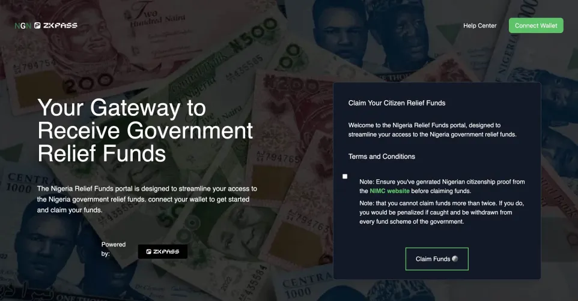
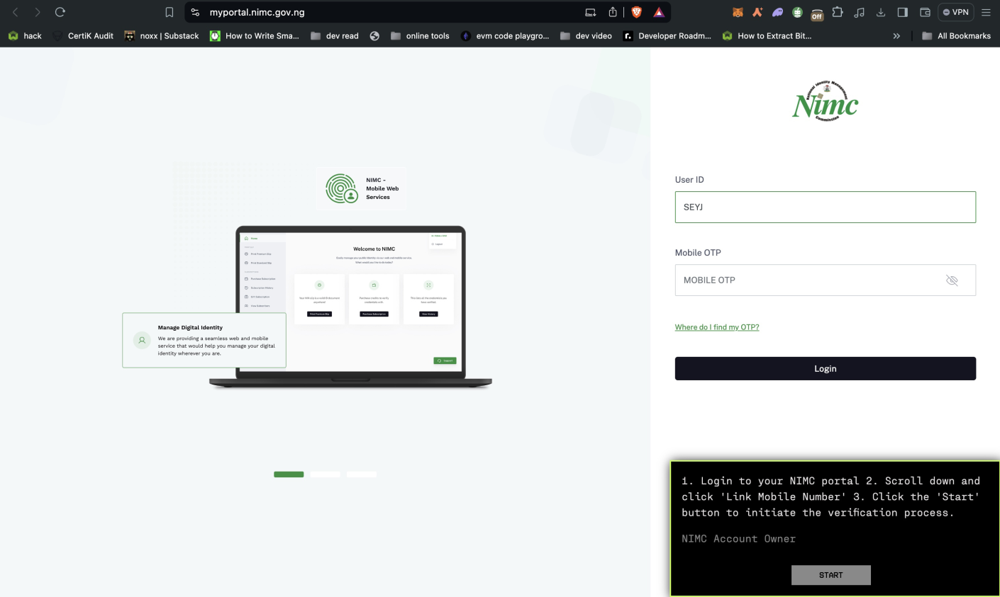
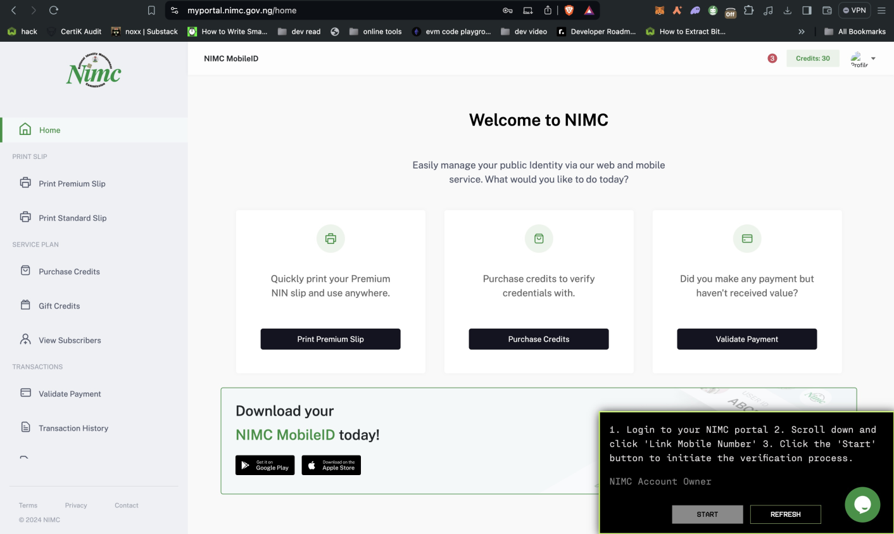
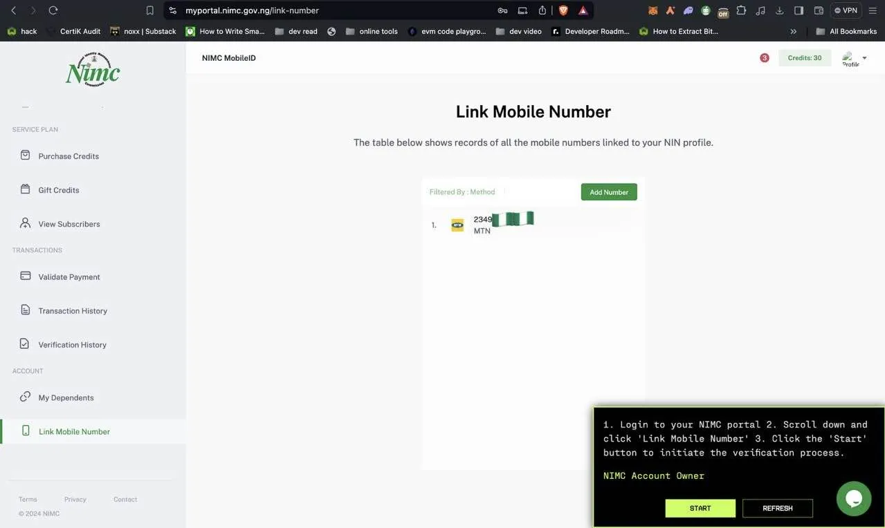
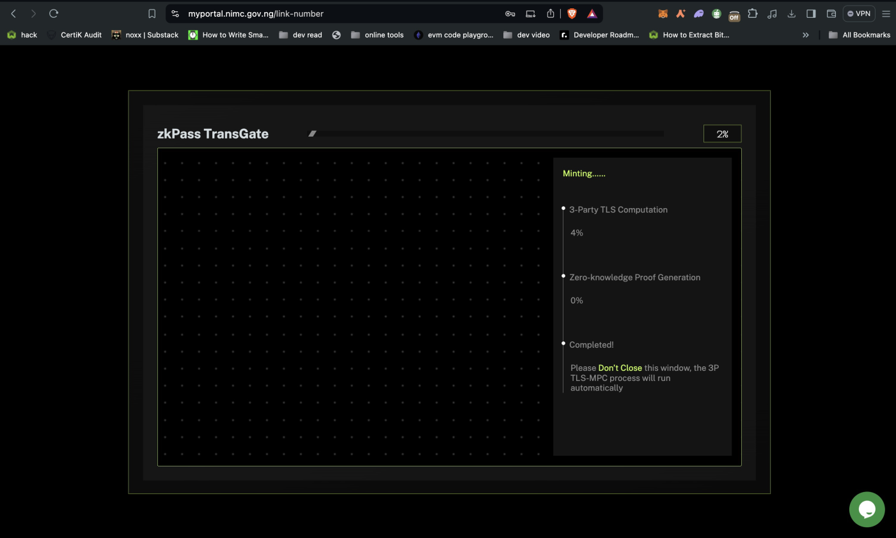

# NGN_ZkPass

### Simplifying Access to Essential Support for Nigerians

#### Relief Chain leveraging on NGN_ZkPass

Welcome to our portal designed to streamline access to vital government relief funds for Nigerian citizens built on the `starknet ecosystem`. In light of the challenges faced during the COVID-19 pandemic and the ongoing cholera outbreak, we have developed a secure and efficient solution for individuals to claim relief funds seamlessly from Nigeria without disclosing their identity. NGN_ZkPass ensures that every eligible citizen can easily generate proof of identity, verify their Nigerian citizenship. Relief chain leverages on this for the distribution of funds.

## Overcoming Barriers and Enhancing Efficiency

We understand that many Nigerians have struggled with traditional methods of applying for government relief, often hindered by complex forms and bureaucratic obstacles. With our application, disbursing funds becomes faster, easier, and more organized. By leveraging Zk-KYC (Zero-Knowledge Know Your Customer) technology via [ZKPASS]("https://zkpass.org/"), we eliminate the need for costly infrastructure, reducing risks for both individuals and the government. Our user-friendly tools and expert support guide you through every step, ensuring you receive the financial assistance you deserve.

## A New Era of Relief Fund Distribution

Our project is more than just a technological innovation; it can be incorporated by any Project intending to verify Nigerian citizenship for their dapp.

By visiting our website (Relief chain), you can seamlessly claim your relief funds without disclosing your identity. This modern approach to fund distribution not only addresses the current crisis but also sets a new standard for future government aid programs.

Join us in creating a more efficient, secure, and equitable system for all Nigerians.

## How to Use the App

### Step-by-Step Guide

1. **Visit Our Website**

   - Go to [NGN_ZkPass](https://ngn-zk-fe.vercel.app/).
     

2. **Log In Into Your NIMC Dashboard**

   - Sign up with your basic information.
   - Ensure you have a valid form of identification for verification.
     

3. **Verify Nigerian Citizenship**

   - Complete the verification process to confirm your Nigerian citizenship.
     
     

4. **Generate Proof of Identity**

   - Use our secure platform to generate a Zero-Knowledge Proof of your identity.
     

5. **Claim Relief Funds**
   - Once verified, follow the instructions to claim your allocated relief funds.
     

## Other info

## Conclusion

NGN_ZkPass is committed to helping enhancing the distribution of government relief funds through innovative and secure technology.and so much more. Join us today and ensure you receive the financial assistance you need without compromising your privacy.
